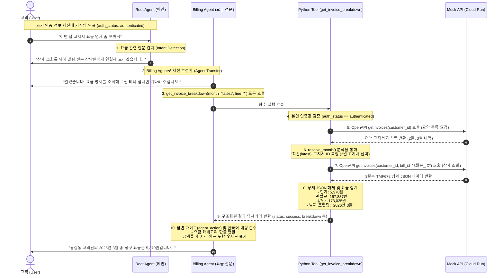

# 📈 정수기 빌링 조회 흐름도 (Invoice Query Flow Diagram)

이 문서는 고객이 **"이번 달 고지서 요금 명세 좀 보여줘"** 라고 발화했을 때, GECX 플랫폼 내부에서 어떤 경로를 거쳐 에이전트 간 세션 이관이 일어나고 백엔드 API와 커스텀 도구가 실행되어 최종 답변을 출력하는지 시각화하여 해설합니다.

---

## 📊 1. 시퀀스 다이어그램 (Sequence Diagram)

아래 다이어그램은 대화 세션의 주도권 이동(메인상담 ➔ 요금전문상담)과 파이썬 도구 내부의 2단계 조회 로직 통신 흐름을 나타냅니다.

---

## 📝 2. 단계별 상세 동작 흐름 해설

### 1단계: 사용자 발화 접수 및 의도 파악
*   **고객**: *"이번 달 고지서 요금 명세 좀 보여줘"*
*   **시스템 상태**: 세션이 처음 시작되어 `root_agent`가 제어권을 쥐고 있습니다.
*   **Root Agent의 역할**: `root_agent` 내부 지침서의 `Intent_Detection` 규칙에 의해, 고객이 '요금', '명세', '고지서' 등의 요소를 질문한 것을 감지합니다.

### 2단계: 전문 서브 에이전트로 세션 이관 (Agent Handoff)
*   **Root Agent의 이관 발화**: *"렌탈 요금 및 결제 관련 문의이시군요. 상세 조회를 위해 빌링 전문 상담원에게 연결해 드리겠습니다. 잠시만 기다려 주십시오."*
*   **GECX 동작**: GECX 엔진이 즉시 `billing_agent`로 대화 세션을 강제 호전환(Agent Transfer Tool 실행)합니다.

### 3단계: 조회 안내 및 도구(Tool) 호출
*   **Billing Agent의 대기 발화**: *"알겠습니다. 요금 명세를 조회해 드릴 테니 잠시만 기다려 주십시오."*
    > [!TIP]
    > **환각 방지 처리**: "기다려 주시면 바로 확인..." 등 문장이 중복되거나 중간에 잘려 출력되는 모델 꼬리표 깨짐 현상을 차단하기 위해, 도구 호출 직전에는 꼬리표 발화 생성을 원천 금지하고 간결한 한 문장만 발화하도록 규칙을 설계했습니다.
*   **도구 매개변수 설정**: 고객이 "이번 달"을 물었으므로 `month="latest"`, 전체 계정 조회를 원했으므로 `line=""` (빈값)으로 파라미터를 완성해 `get_invoice_breakdown` 도구를 호출합니다.

### 4단계: 파이썬 커스텀 도구의 인증 필터 및 1차 목록 조회 (REST API)
*   **인증 및 URN 확인**: 도구 함수 내부에서 `context.state`에 저장된 `auth_status == "authenticated"` 조건과 `account_id` 고유 URN의 실재 여부를 교차 검증합니다.
*   **요약 목록 요청**: OpenAPI 툴셋(`tools.purifier_billing_getInvoices`)을 통해 모의 API 서버로 요약 고지서 목록 조회를 요청합니다. (이때 대용량 페이로드 방지를 위해 `fields` 필터링을 걸어 5개 핵심 필드만 가볍게 요청함).

### 5단계: 타겟 청구월 식별 및 2차 상세 내역 로드
*   **청구월 타겟팅**: 로드된 요약 목록에서 `resolve_month` 함수를 실행하여 가장 최신(3월) 고지서 정보 개체를 찾아내고, 해당 고지서의 고유 ID(`urn:purifier:rental:product:ban-billdoc:...`)를 추출합니다.
*   **단건 상세 정보 요청**: 알아낸 고유 ID를 `bill_id` 파라미터에 채워 넣어 다시 한 번 모의 API 서버로 3월 고지서 상세 내역 전체(TMF678 형식 JSON)를 요청합니다.

### 6단계: 데이터 가공 및 정형화 (Formatting)
*   **날짜/이용기간 한글 조립**: 툴 내부에서 `datetime` 연산을 통해 날짜 정보를 `"2026년 3월"`, `"2026년 2월 28일 ~ 3월 27일"`, `"2026년 4월 2일"` 등의 한글 포맷 문자열로 변환합니다. (GECX 유니코드 파서 오류 방지를 위해 소스코드 내에는 `\ub144`, `\uc6d4` 등 유니코드 기법 적용).
*   **요금 항목 집계 및 반올림**: 3월 고지서 상세 JSON의 `billSummaryItem` 목록을 파싱하여 기본 렌탈료, 서비스료, 결합 할인액 등의 세부 내역을 원화 정수 단위(소수점 제거 반올림)로 정규화합니다.
*   **도구 출력 반환**: 가공 완료된 최종 딕셔너리 정보와 에이전트 행동 복구 가이드(`agent_action`)를 담아 `billing_agent`에게 반환합니다.

### 7단계: 최종 한국어 응답 생성
*   **Billing Agent의 답변 작문**: 툴이 반환한 `breakdown` 정보와 `agent_action`의 안내 규칙에 따라 영문 요금 명칭을 한글(예: `Discounts` ➔ `"제휴카드 및 패키지 결합 할인액"`)로 일대일 매핑하고, 화폐 금액을 세 자리마다 쉼표가 들어간 깔끔한 숫자 형식(`"5,370원"`, `"167,837원"`)으로 포맷팅하여 최종 음성/텍스트 응답을 출력합니다.
*   **추가 질문 제안**: 답변의 마지막에 `"제품별 세부 요금 명세도 안내해 드릴까요?"`라는 후속 퀴리 옵션을 제시하여 고객이 기기별 요금 조회를 유기적으로 이어가도록 제안합니다.

---

## 🔗 연관 참조 문서
*   [GECX 콘솔 배포 전체 가이드](./DEPLOYMENT_GUIDE.md)
*   [get_invoice_breakdown 도구 파이썬 소스 코드](./tools/get_invoice_breakdown.py)
